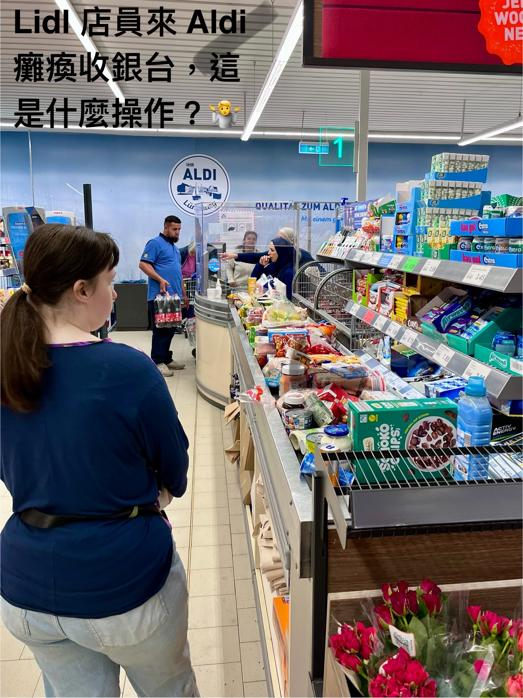

這幾年在德國生活有一個觀察：看起來最滿的那台購物車後面，通常是結帳速度最快的隊伍。

聽起來很反直覺對吧？但我發現，最拖時間的不是掃條碼，是「人」：跟收銀員打招呼、錢包或信用卡找半天、等發票印出來、再慢慢把東西收好……這些零碎動作加起來就耗掉不少時間。

重點不是前面有多少東西，而是有多少人。

所以下次排隊別只看有幾台推車，反而挑「人最少」的那一排；就算輸送帶上擺得滿滿的，也可能更快結完帳、走出超市。

